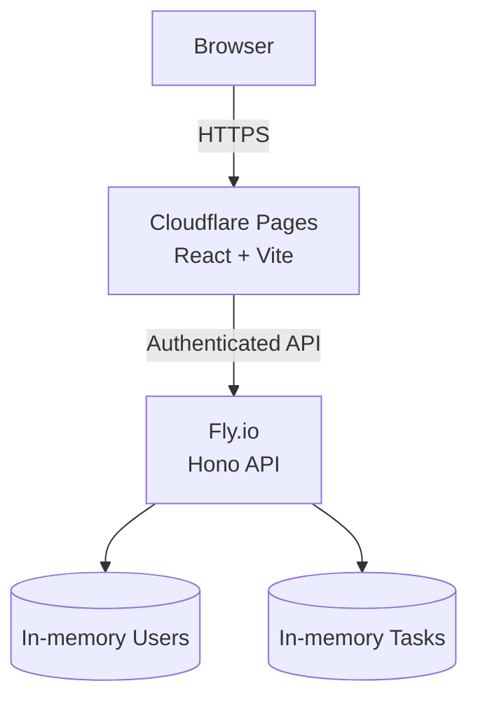
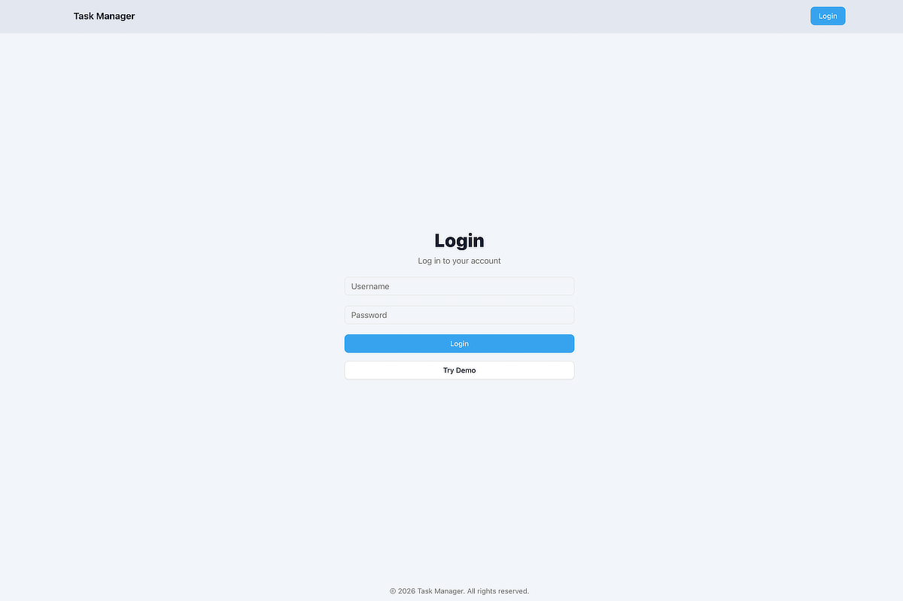
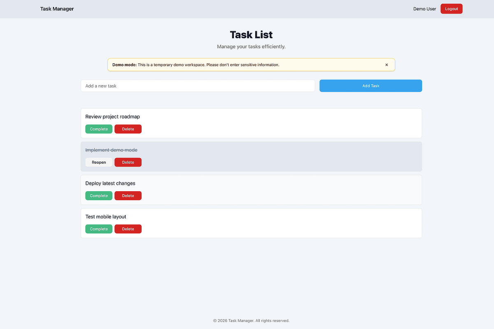
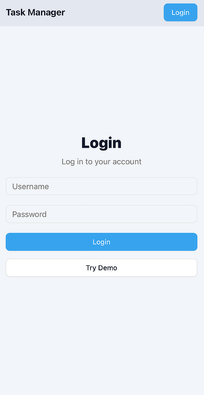
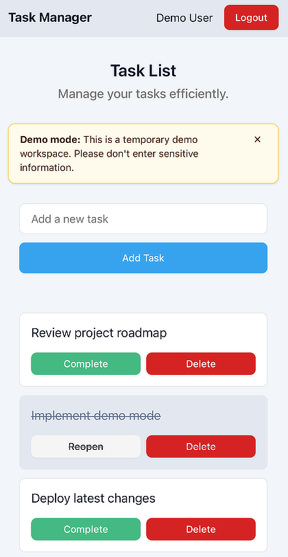

# Task Manager

A full-stack task management application built with Bun, Hono, React, and shared TypeScript types.

This project focuses on end-to-end application architecture using the BHVR stack, emphasizing shared types, clean API boundaries, authentication flows, and pragmatic UI state management.

**Live demo:** https://task-manager.davidmoriarty.dev
The application includes a built-in **Demo Mode**, allowing visitors to explore the app immediately without creating an account.

## Why this project

This project exists to demonstrate:

- End-to-end type safety between client and server
- Clean API design with predictable request/response flows
- Practical authentication patterns
- Shared domain models across frontend and backend
- A modern full-stack setup without framework lock-in

To support this goal, the application is intentionally implemented with specific architectural constraints.

## Features

- Secure JWT authentication
- Instant Demo Mode (no signup required)
- Create, complete, reopen, and delete tasks
- Responsive mobile-first interface
- Light and dark mode
- Shared TypeScript types across client and server
- End-to-end type-safe API
- CI with GitHub Actions
- Independent Cloudflare Pages + Fly.io deployment

## Demo Mode

Task Manager supports two ways to explore the application:

- **Demo Mode** — Click **Try Demo** on the login page to launch a temporary workspace populated with sample tasks. This workspace resets each time a new demo session is started and should not be used for sensitive information.

- **Personal Account** — Create your own account using the signup API (described below) and log in with your own credentials. User accounts and tasks are stored in memory and will reset whenever the server restarts or is redeployed.

Internally, the backend stores users and tasks in memory. This keeps the project focused on API design, shared types, and authentication flows rather than persistence. A database-backed implementation is intentionally left as a future enhancement.

## API Signup Example (2 minutes)

If you'd like to use your own account instead of the built-in Demo Mode, you can create one directly through the API:

### 1. Create a user
```bash
curl -i \
  -H "Content-Type: application/json" \
  -X POST "https://server-aged-dew-6516.fly.dev/auth/signup" \
  -d '{"username":"demo","password":"test1234"}'
```

### 2. Log in
```bash
curl -i \
  -H "Content-Type: application/json" \
  -X POST "https://server-aged-dew-6516.fly.dev/auth/login" \
  -d '{"username":"demo","password":"test1234"}'
```
The response will include a JWT token.

### (Optional) Verify the API directly
```bash
curl -H "Authorization: Bearer <TOKEN>" \
  https://server-aged-dew-6516.fly.dev/tasks
```

You should receive an empty array until tasks are created via the UI.

### 3. Use the app
- Visit: https://task-manager.davidmoriarty.dev
- Log in with:
  - Username: demo
  - Password: test1234
- Create, complete, reopen, and delete tasks

Note: Data is stored in memory and resets on server restart. This is intentional for demo purposes.

## Architecture



## Screenshots

<p>
  Task Manager is fully responsive, with optimized layouts for desktop and mobile.
</p>

<h3>Desktop</h3>

<p align="center">
  
  
</p>

<h3>Mobile</h3>

<p align="center">
  
  
</p>

## Tech Stack

- **Runtime:** Bun
- **Backend:** Hono
- **Frontend:** React + Vite
- **Type Sharing:** Shared workspace package
- **Monorepo Tooling:** Turbo

This app follows the BHVR stack approach, providing a lightweight full-stack monorepo with shared types and flexible deployment options.

## Status

Current release includes:

- JWT authentication
- Built-in Demo Mode
- Responsive desktop and mobile UI
- Light and dark themes
- Shared TypeScript models
- GitHub Actions continuous integration
- Independent frontend/backend deployment

Planned follow-ups include:
- Database-backed persistence
- Production-grade authentication
- Expanded production hardening

## Deployment Notes

The frontend is deployed on Cloudflare Pages and the backend API is deployed on Fly.io.

The backend intentionally stores all data in memory. User accounts and tasks reset whenever the server restarts or is redeployed. This deployment exists to demonstrate the application's architecture rather than provide durable storage.

## Limitations & Design Notes

This project is intentionally scoped for architectural clarity rather than production completeness:

- **Authentication**
  - Uses a simplified token-based flow suitable for demos and local development.
  - Tokens are stored client-side and are not persisted across server restarts.
  - JWTs are short-lived and expire automatically after a set period.
  - Passwords are hashed using bcrypt.
  - No OAuth or refresh-token rotation is implemented in this version.

- **Persistence**
  - Tasks are stored in memory on the server.
  - Data resets on server restart; no database is currently configured.
  - Persistence is a planned follow-up to demonstrate database integration.

- **Deployment**
  - The app is structured for flexible deployment, but is currently intended to run locally.
  - Client and server can be deployed independently once persistence is added.

These constraints are deliberate to keep the focus on **type sharing, API boundaries, and full-stack structure** rather than infrastructure complexity.

## What I’d Do Differently in Production

If this application were being prepared for production use, I would make the following changes:

- **Authentication**
  - Replace localStorage-based JWT storage with secure HttpOnly cookies and refresh-token rotation.
  - Store auth tokens in HttpOnly cookies instead of localStorage.
  - Add proper error handling, rate limiting, and account lockout protections.

- **Persistence**
  - Introduce a relational database (e.g. PostgreSQL or SQLite) for task and user data.
  - Add migrations and explicit data access layers.
  - Persist user sessions and task state across restarts.

- **API & Security**
  - Validate all request payloads using a schema validation layer.
  - Harden headers and CORS configuration for production environments.
  - Add structured logging and error monitoring.

- **Frontend**
  - Improve loading and error states for slower or unreliable networks.
  - Add optimistic updates with rollback for a smoother UX.
  - Improve accessibility auditing and keyboard flows across all views.

- **Deployment**
  - Deploy the API and client independently.
  - Add environment-specific configuration and secrets management.
  - Configure CI for linting, type-checking, and builds.

These changes are intentionally deferred in this version to keep the project focused on **full-stack structure, type sharing, and API clarity** rather than infrastructure complexity.

## Project Structure

- ├── client/   # React frontend
- ├── server/   # Hono API
- ├── shared/   # Shared TypeScript types

## Getting Started

```bash
bun install
bun run dev
```

## Appendix: Why BHVR?

This project follows a BHVR-style full-stack setup:

- **B**un — fast runtime + package manager, consistent tooling across the monorepo
- **H**ono — small, explicit routing/middleware model that keeps API boundaries clear
- **V**ite — fast frontend dev/build pipeline with a simple deployment artifact (`dist/`)
- **R**eact — pragmatic UI composition with a mature ecosystem

### Why this combination?

- **Clear API boundary:** the server is a small Hono app with explicit routes + middleware.
- **Shared types end-to-end:** a `shared` workspace package exports domain models (e.g. `Task`, `User`, `ApiResponse`) so the client and server stay aligned.
- **Monorepo ergonomics:** Turbo coordinates builds across `shared`, `server`, and `client` while keeping each deployable independently.
- **Minimal framework lock-in:** the architecture is intentionally lightweight—swap the DB layer, swap auth strategy, deploy client/server separately, etc.

### What this project is optimized for

- Demonstrating full-stack architecture, shared typing, and predictable request/response flows
- Keeping the codebase understandable and portable to production hardening (DB, cookies, schema validation, rate limiting)

## Related Links

- Portfolio: https://davidmoriarty.dev/projects/task-manager
- GitHub: https://github.com/davidmoriarty/task-manager
